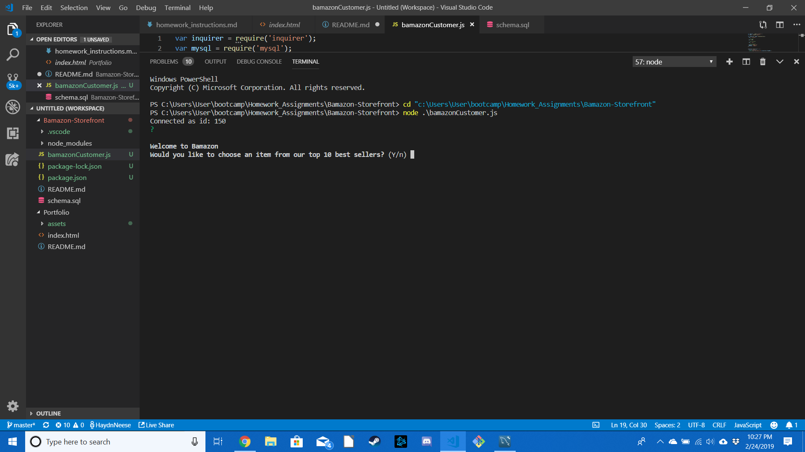
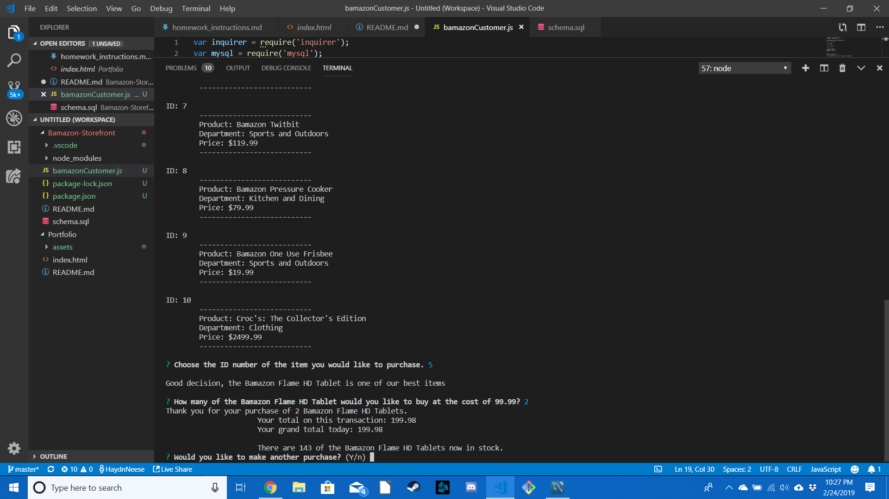
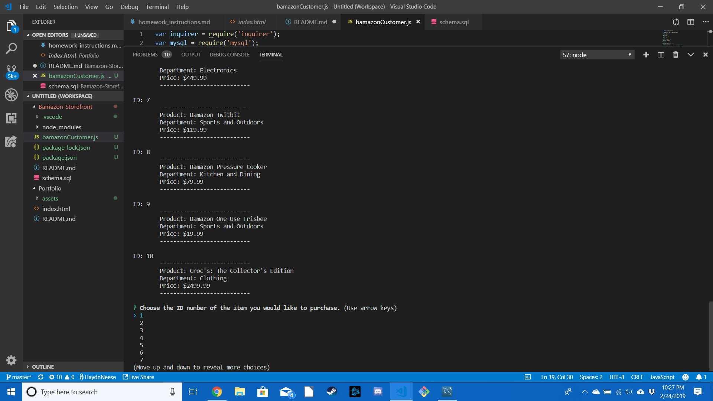

# Bamazon-Storefront

## **What it does:**
---

The app is a Node.js application that offers up the top 10 best selling items on Bamazon to the user.
```* The app accesses the mySQL database for Bamazon
* The app asks if the user would like to browse through Bamazon's top 10 products
* The user may choose which item in the store they would like to purchase
    * This is done by choosing the ID number of the item from the list the user prefers
* Then they decide how many of the item they chose they would like to purchase
    * They will be prompted by the program to enter a number of their choosing
* This then updates the database with the new quantity of that item left in stock
* Then returns to the user the total cost of the purchase and their total cost of all their purchases if they have more than one
* The app will then ask the user if they would like to make another purchase or stop shopping
* If the user requests too many of the item and there isn't that many in stock according to the database then the program will notify them and allow the user to start a new purchase or stop the buying anymore products
```
---
## **How to start:** 
---

```NPM INSTALL INQUIRER```  
```NPM INSTALL MYSQL```

```* Begin by opening the terminal and accessing the correct file.
* Then type node bamazonCustomer.js
* The user will be prompted to choose the item to purchase and its quantity
* Then finally after you are given all the info about your purchase you can choose to buy another item or close out of the program
```
---
## **EXAMPLES:**
---
### Shopping confirmation

### Inventory Display

### Choose ID of Desired Product

### Quantity of Purchase

### Current Cost/Would You Like Another Purchase?

### Quantity of Purchase

### New Current Cost and Ask For New Transaction

### Purchase Quantity

### New Cost with All Purchases Added and New Transaction Offer

### Request Quantity

### Notice That The Requested Item Is Out of Stock

